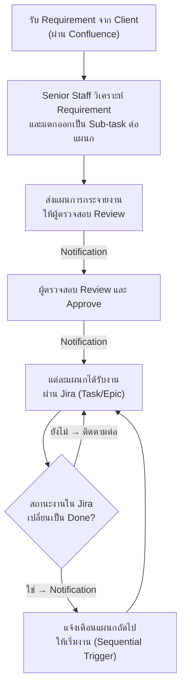

# AI-Assisted Workload Distribution Platform
### เอกสารสรุปที่มา ปัญหา และเป้าหมายของการทำ Mockup (Pre-Project)

**หน่วยงาน:** Depository & Registrar Department, Thailand Securities Depository (TSD), SET Group
**สถานะ:** Pre-Project — อยู่ระหว่างสำรวจแนวทางและออกแบบ UI/UX ก่อนเริ่มพัฒนาจริง

---

## 1. ที่มาของโครงการ (Background)

ฝ่าย Depository & Registrar เป็นหน่วยงานที่รับ requirement จาก client/ลูกค้าในหลากหลายรูปแบบ 
<!--เช่น

- การเปลี่ยนแปลงตามกฎระเบียบ (Regulatory Change)
- การพัฒนาระบบใหม่ (System Development)
- การสนับสนุน UAT (UAT Support)
- การย้ายข้อมูล (Data Migration)
- การจัดทำเอกสาร (Documentation) -->
แต่ละ requirement ที่เข้ามา จะต้องถูก **วิเคราะห์และกระจายงาน (workload distribution)** ไปยังแผนกที่เกี่ยวข้อง ได้แก่ Business Analysis, Development, QA & Testing และ Registrar Operations ซึ่งในหลายกรณีงานของแผนกต่าง ๆ มีลำดับก่อน-หลังที่ชัดเจน (sequential phase) เช่น BA ต้องวิเคราะห์และส่งสเปคก่อน Dev จึงเริ่มพัฒนาได้ และ Dev ต้องเสร็จก่อน QA จึงเริ่มทดสอบได้

---

## 2. กระบวนการทำงานที่ควรจะเป็น (Target Workflow)

จากการพูดคุยกับผู้บังคับบัญชา ภาพรวมของกระบวนการที่ต้องการให้ระบบรองรับ มีดังนี้

ในขั้นตอนนี้ AI จะเข้ามาช่วย **เฉพาะตอนวิเคราะห์ requirement และแนะนำการแตก sub-task** (จุด B) เท่านั้น โดยข้อเสนอของ AI ยังต้องผ่านการตรวจสอบและอนุมัติจากมนุษย์เสมอ (Human-in-the-loop) ก่อนที่ระบบจะสร้างงานจริงใน Jira และส่งอีเมลแจ้งเตือน

---

## 3. ปัญหาที่ทำให้เกิดโครงการนี้ (Problem Statement)

| # | ปัญหา | รายละเอียด |
|---|---|---|
| 1 | **การวิเคราะห์และแตก sub-task ทำด้วยมือทั้งหมด** | Senior staff ต้องอ่าน requirement เอง ตัดสินใจเองว่าควรแบ่งงานอย่างไร แผนกไหนรับผิดชอบส่วนใด — ใช้เวลานานและขึ้นอยู่กับประสบการณ์ส่วนบุคคล ทำให้ผลลัพธ์ไม่ consistent |
| 2 | **ไม่มีขั้นตอนอนุมัติที่เป็นระบบ** | การส่งแผนงานให้ตรวจทานและอนุมัติทำผ่านการพูดคุย/อีเมลแบบ ad-hoc ไม่มีบันทึกที่ตรวจสอบย้อนหลังได้ และไม่มีการบังคับว่าผู้สร้างคำขอห้ามอนุมัติงานของตนเอง |
| 3 | **การแจ้งเตือนแผนกถัดไปไม่แม่นยำ / ล่าช้า** | เมื่องานของแผนกหนึ่งเสร็จ (status = Done ใน Jira) แผนกถัดไปมักไม่รู้ตัวว่าต้องเริ่มงานทันที ทำให้เกิดช่วงเวลาที่งาน "ตกหล่น" ระหว่างแผนก |
| 4 | **ไม่มี Audit Trail ของการกระจายงานและการอนุมัติ** | ไม่สามารถตรวจสอบย้อนหลังได้ว่าใครเป็นผู้เสนอ ใครอนุมัติ และมีการเปลี่ยนแปลงอะไรบ้างก่อนอนุมัติ — เป็นความเสี่ยงด้าน compliance |
| 5 | **ข้อมูลกระจัดกระจาย ไม่มีภาพรวม** | ไม่มี Dashboard ที่แสดงสถานะคำขอทั้งหมด, งานที่รออนุมัติ, หรือภาระงานของแต่ละแผนกในภาพเดียว |

---

## 4. ผลกระทบ (Impact)

- **ความล่าช้าในการส่งมอบงาน** เนื่องจากการวิเคราะห์และส่งต่องานระหว่างแผนกใช้เวลานานและพึ่งพาคนเป็นหลัก
- **งานซ้ำซ้อน / มอบหมายผิดแผนก** เพราะการแตก sub-task ไม่ได้มาตรฐานเดียวกันในแต่ละครั้ง
- **ความเสี่ยงด้าน Compliance** จากการไม่มี audit trail และไม่มีการบังคับ "ผู้สร้าง ≠ ผู้อนุมัติ"
- **ผู้บริหารไม่เห็นภาพรวม** ของปริมาณงานและความเสี่ยง (risk) ในแต่ละช่วงเวลา

---

## 5. แนวทางแก้ไข: AI-Assisted Workload Distribution Platform

โครงการนี้เสนอให้พัฒนาเว็บแพลตฟอร์ม (Next.js + TypeScript) ที่ช่วย Senior Staff:

1. **ป้อน requirement** ของ client เข้าระบบ (พิมพ์ข้อความ หรืออัปโหลดไฟล์)
2. ให้ **AI (Gemini API)** วิเคราะห์และ **แนะนำ** การแตก main task / sub-task พร้อมแผนก ผู้รับผิดชอบ ความเร่งด่วน และ confidence score — แสดงผลแบบ real-time ผ่าน sidebar (SSE streaming)
3. Senior Staff **ตรวจสอบและปรับแก้** คำแนะนำของ AI ได้ทุกจุด
4. ส่งแผนงานให้ **ผู้ตรวจสอบ (Approver)** อนุมัติ — ระบบบังคับว่าผู้สร้างคำขอห้ามเป็นผู้อนุมัติเอง
5. เมื่อ **อนุมัติแล้วเท่านั้น** ระบบจะ:
   - สร้าง Task/Epic ใน **Jira** ให้แต่ละแผนกอัตโนมัติ
   - ส่ง **อีเมลแจ้งเตือน** ไปยังผู้รับผิดชอบแต่ละแผนก
6. ระบบ **ติดตามสถานะ Jira** ของแต่ละ phase และจะแจ้งเตือนแผนกถัดไป **ก็ต่อเมื่อ phase ปัจจุบันมีสถานะเป็น Done เท่านั้น** (sequential trigger)
7. ทุกการกระทำที่เปลี่ยนข้อมูล (สร้าง/อนุมัติ/ปฏิเสธ) จะถูกบันทึกใน **Audit Trail** แบบ append-only

หลักการสำคัญ: **AI เป็นที่ปรึกษา (Advisory) เท่านั้น มนุษย์เป็นผู้ตัดสินใจสุดท้ายในทุกขั้นตอน**

---

## 6. เป้าหมายของการทำ Mockup ในช่วง Pre-Project

ก่อนเริ่มพัฒนาระบบจริงตามแผน Sprint 8 สัปดาห์ จึงได้จัดทำ **Mockup (HTML/CSS/JS แบบจำลอง)** เพื่อ:

- ทดสอบและสื่อสาร **flow การทำงาน** (Staff สร้างคำขอ → AI แนะนำ → Approver อนุมัติ → สร้างงาน → ติดตาม phase) ให้ผู้บังคับบัญชาเห็นภาพก่อนลงมือพัฒนาจริง
- เปรียบเทียบแนวทาง **UI/UX** หลายรูปแบบ (สำรวจด้วย AI หลายตัว ได้แก่ ChatGPT, Gemini, Claude) เพื่อเลือกแนวทางที่ตอบโจทย์ผู้ใช้งานจริงที่สุด
- ตรวจสอบว่า design ที่ได้ **ตรงกับ data model (Prisma schema) และ business rules** ที่กำหนดไว้ (เช่น Department enum, RequestStatus, สี/label ภาษาไทย, sequential phase)
- ลดความเสี่ยงในการพัฒนาผิดทาง — แก้ไขที่ Mockup ใช้เวลาน้อยกว่าแก้ไขหลังเขียนโค้ดจริงมาก

---

## 7. สรุป Mockup ที่ได้จัดทำในขั้นนี้

| ไฟล์ | แนวทาง | จุดเด่น |
|---|---|---|
| `workload_by_gemini_001.html`, `workflow_by_gemini_002.html`, `workflow_by_gemini_003.html` | Gemini | วาง layout หลัก: Login เลือก role, AI sidebar, ตาราง plan, Approval queue, Notifications |
| `workflow_by_chat_gpt_001.html`, `workflow_by_chat_gpt_002.html` | ChatGPT | สำรวจรูปแบบ layout และ component อีกแนวทางหนึ่งสำหรับเปรียบเทียบ |
| `workload_by_claude_001.html` | Claude (รอบที่ 1) | ทดลอง component-level design (AI suggestion card แบบ accept/edit) |
| **`workflow_by_claude_002.html`** | **Claude (รอบที่ 2 — ล่าสุด)** | ปรับปรุงจาก `gemini_003`: แก้ bug, เพิ่ม **Dashboard** ภาพรวม, เพิ่ม **Sequential Phase Tracker** (สาธิต Rule: แจ้งเตือนแผนกถัดไปเมื่อ phase ปัจจุบัน = Done เท่านั้น), ปรับ AI sidebar ให้แสดง **Confidence Score / Risk Flags / Model badge** และจัดให้ label/สี ของ Department & Status ตรงกับ data model จริง |

Mockup ล่าสุด (`workflow_by_claude_002.html`) ครอบคลุม flow ทั้งหมดตั้งแต่ Dashboard → สร้างคำขอ + AI แนะนำ → Approval + Phase Tracker → Notification ซึ่งสามารถเปิดใน browser และสาธิตการทำงานแบบ end-to-end ได้ทันที (สลับ role staff/approver เพื่อดูทั้งสองมุมมอง)

---

## 8. ขั้นตอนถัดไป (Next Steps)

1. รวบรวม feedback จากการนำเสนอ Mockup นี้ เพื่อสรุปแนวทาง UI/UX ที่จะใช้จริง และ feature เพิ่มเติม
2. แปลง Mockup เป็น Functional Requirements (FR) ตาม format มาตรฐาน
3. เริ่มพัฒนาตามแผน Sprint 6 สัปดาห์ (Next.js 14 + TypeScript + Prisma + Gemini API)
   - Week 1-2: Schema, Auth, Route Handler พื้นฐาน, AI sidebar (SSE)
   - Week 3-4: Approval flow, Jira integration, Email notification, Frontend pages
   - Week 5-6: End-to-end test, bug fix, presentation รอบสุดท้าย
